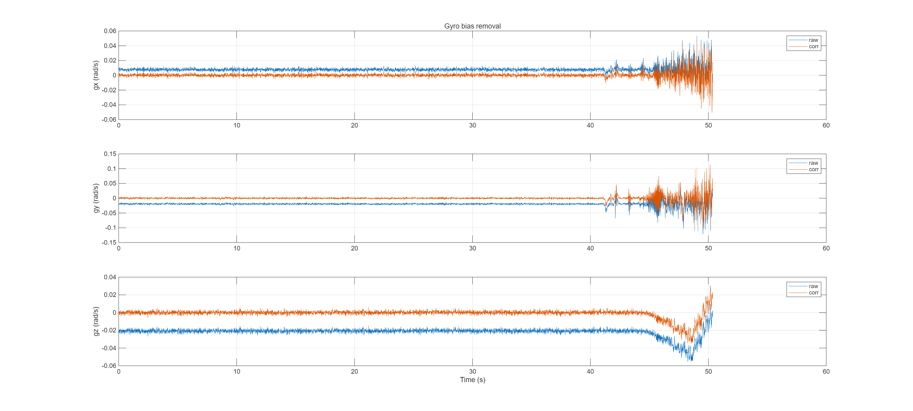

# Localization Workspace (ROS 2) — GPS/IMU Fusion, Preprocess, Analysis

This workspace contains a small, modular localization stack for fusing GNSS and IMU, plus utilities for IMU preprocessing and offline analysis. The GUI package is excluded from this README by request.

Packages covered here:
- `imu_preprocess`: IMU bias removal and low‑pass filtering node
- `gps_imu_fusion`: Full EKF fusion stack (GNSS + IMU) with TF and utilities
- `gps_imu_fusion_ihw`: Lightweight EKF fusion (position + velocity + yaw)
- `imu_analysis`: MATLAB scripts for offline IMU QA, bias estimation, and LPF selection

---

## Quick Start

- Build (skip GUI):
  - `colcon build --packages-skip gui`
  - `source install/setup.bash`

- Typical pipeline (two variants):
  - Variant A — `imu_preprocess` → `gps_imu_fusion` EKF
    - `ros2 launch imu_preprocess imu_preprocess.launch.py`
    - `ros2 launch gps_imu_fusion ekf_fusion.launch.py`
  - Variant B — `gps_imu_fusion_ihw` minimal EKF (directly uses IMU + local XY)
    - `ros2 launch gps_imu_fusion_ihw gps_imu_fusion_launch.py`

---

## Package Overview

### imu_preprocess

- Purpose: Clean raw IMU by removing static bias and attenuating high‑frequency noise with a first‑order IIR low‑pass filter.
- I/O:
  - Subscribes: `/imu/data` (`sensor_msgs/Imu`)
  - Publishes: `/imu/processed` (`sensor_msgs/Imu`)
- Key parameters (`imu_preprocess/config/imu_bias.yaml`):
  - `use_precalibrated_bias` (bool): if true, use the provided `bias_acc_*`, `bias_gyro_*`
  - `bias_acc_x|y|z`, `bias_gyro_x|y|z`: static biases
  - `lpf_cutoff` (Hz): 0 disables LPF; lower → smoother
  - `remove_gravity` (bool), `gravity_magnitude`
  - If runtime calibration is desired, use a config that sets `use_precalibrated_bias: false` and `calib_duration` (s)
- Launch: `ros2 launch imu_preprocess imu_preprocess.launch.py [config:=imu_bias.yaml]`
- Notes: Designed to precede the EKF. Keep IMU QoS as `SensorDataQoS` when remapping sources.

### gps_imu_fusion_ihw (Complementary Yaw — Main)

- Purpose: Lightweight localization with a focus on robust global yaw from a complementary filter. Includes:
  - `global_yaw_complementary_node` (primary): IMU yaw-rate integration corrected by GPS-derived yaw
  - `global_yaw_integrator_node`: pure integration baseline without GPS correction
  - `sensor_fusion_node` + `kalman_filter`: compact 5‑state EKF for x, y, vx, vy, yaw using body accelerations and yaw‑rate
  - `current_speed_node`: helper for speed estimation
- Yaw algorithm (complementary):
  - Initialize yaw from recent GPS displacement direction once moved beyond a distance threshold
  - Integrate IMU `ω_z` per message: `psi ← wrap(psi + ω_z·Δt)`
  - When GPS yaw is fresh and speed is above `v_min`, correct with small gain: `psi ← wrap(psi + k_corr·wrap(psi_gps − psi))`
  - Angle wrapping with `atan2(sin, cos)` keeps yaw in [–π, π)
- I/O:
  - Subscribes: `/imu/processed` (`sensor_msgs/Imu`), `/local_xy` (`geometry_msgs/PointStamped`) for yaw nodes; `/ouster/imu` + `/local_xy` for minimal EKF
  - Publishes: `/global_yaw` (`std_msgs/Float32`) from yaw nodes, `/odometry/fusion` (`nav_msgs/Odometry`) and optional TF from the EKF node
- Key parameters (yaw, typical):
  - `k_corr` (0.01–0.05): GPS correction gain
  - `gps_timeout` (~1.5× GPS period): ignore stale GPS yaw
  - `v_min` (m/s): minimum speed to trust GPS yaw
  - `dist_min` (m): minimum traveled distance before using GPS to initialize yaw
- Launch examples:
  - Complementary yaw (recommended):
    - `ros2 run gps_imu_fusion_ihw global_yaw_complementary_node`
  - Integrator baseline:
    - `ros2 run gps_imu_fusion_ihw global_yaw_integrator_node`
  - Minimal EKF (x,y,vx,vy,yaw):
    - `ros2 launch gps_imu_fusion_ihw gps_imu_fusion_launch.py`
- Tips:
  - Prefer `/imu/processed` from `imu_preprocess` to reduce drift and improve yaw stability.
  - Tune `k_corr` up for more aggressive GPS correction; reduce if GPS noise causes jitter.

### gps_imu_fusion

- Purpose: Full‑featured EKF that fuses GNSS position/velocity and processed IMU to publish odometry and TF. Includes geographic conversions (GeographicLib), ZUPT handling, heading options, lever‑arm compensation, and visualization helpers.
- I/O (typical):
  - Subscribes: `/ublox_gps_node/fix` (`sensor_msgs/NavSatFix`), `/ublox_gps_node/fix_velocity` (`geometry_msgs/TwistWithCovarianceStamped`), `/imu/processed` (`sensor_msgs/Imu`)
  - Publishes: `/odom` (`nav_msgs/Odometry`), optional `TF` (`map → base_link`), and `nav_msgs/Path`
- Config: `gps_imu_fusion/config/fusion_params.yaml` (extensive inline docs). Includes tuning for process/measurement noise, heading usage, ZUPT thresholds, lever‑arm limits, and 2D‑mode options.
- Launch:
  - `ros2 launch gps_imu_fusion ekf_fusion.launch.py`
  - For a ready‑made vehicle profile + TF tree: `ros2 launch gps_imu_fusion ekf_fusion_nocheon.launch.py`
- Utilities:
  - `gps_imu_fusion/scripts/gps_vis/*`: quick CSV/bag visualization tools in RViz2
  - `gps_imu_fusion/ekf_tuning_scripts/*`: Python helpers to analyze IMU noise/bias and generate EKF parameter presets
- Build deps: Eigen3, GeographicLib, tf2, ROS 2 common message packages

### gps_imu_fusion_ihw

- Purpose: Compact EKF that estimates `[x, y, vx, vy, yaw]` and outputs odometry, yaw, and optional TF. Uses body‑frame accelerations and yaw‑rate as control input; GPS provides x/y updates.
- I/O:
  - Subscribes: `/ouster/imu` (`sensor_msgs/Imu`), `/local_xy` (`geometry_msgs/PointStamped`)
  - Publishes: `/odometry/fusion` (`nav_msgs/Odometry`), `/global_yaw` (`std_msgs/Float32`), optional `TF` (`map → base`)
- Config: `gps_imu_fusion_ihw/config/gps_imu_fusion.yaml`
  - `sigma_a`, `sigma_omega` → process noise; `gps_cov` → measurement noise; `dt_default`; `map_frame`, `base_frame`, `publish_tf`
- Launch: `ros2 launch gps_imu_fusion_ihw gps_imu_fusion_launch.py`
- Notes: Best for lightweight setups where gyro bias is small or already handled in preprocessing.

### imu_analysis (offline, MATLAB)

- Purpose: End‑to‑end, offline IMU QA pipeline on a ROS 2 bag folder to quantify gyro bias and pick LPF cutoffs.
- Steps (run in `imu_analysis/matlab`):
  - `step01_load_imu_bag.m`: read `../imu_analysis_bag` (`/imu/data`) → save `../outputs/imu_raw.mat`
  - `step02_qc_overview.m`: overview plots and basic stats
  - `step03_estimate_gyro_bias.m`: estimate static gyro bias
  - `step04_remove_gyro_bias.m`: apply bias removal and visualize impact
  - `step05_acc_fft.m`: FFT/PSD to study accelerometer noise vs cutoff
  - `step06_export_summary.m`: write `06_summary.csv` and `06_summary.txt` with suggested LPF settings
- Output examples are in `imu_analysis/outputs/`

#### IMU Analysis Gallery

Below are sample outputs from `imu_analysis/outputs` (clickable in most IDEs):

<table>
  <tr>
    <td align="center">
       
      <b>1. Gyro Bias Histogram (static)</b>
    </td>
    <td align="center">
       
      <b>2. Static Window Detection</b>
    </td>
  </tr>
  <tr>
    <td align="center">
       
      <b>3. Bias Removal Effect (before→after)</b>
    </td>
    <td align="center">
       
      <b>4. Accelerometer FFT (selected)</b>
    </td>
  </tr>
  <tr>
    <td align="center">
       
      <b>5. FFT Comparison (X vs Y)</b>
    </td>
    <td align="center">
       
      <b>6. LPF Timeseries (acc, all axes)</b>
    </td>
  </tr>
  <tr>
    <td align="center">
       
      <b>7. LPF Timeseries (X/Y focus)</b>
    </td>
    <td align="center">
       
      <b>8. PSD ax (Welch)</b>
    </td>
  </tr>
  <tr>
    <td align="center">
       
      <b>9. PSD ay (Welch)</b>
    </td>
    <td align="center">
       
      <b>10. RMS Improvement (before vs after)</b>
    </td>
  </tr>
  
</table>

---

## End‑to‑End Usage

- Preprocess → EKF (recommended):
  - Start IMU preprocessing:
    - `ros2 launch imu_preprocess imu_preprocess.launch.py config:=imu_bias.yaml`
  - Run the EKF (choose one):
    - Full stack: `ros2 launch gps_imu_fusion ekf_fusion.launch.py`
    - Minimal: `ros2 launch gps_imu_fusion_ihw gps_imu_fusion_launch.py`
- Bag playback tips:
  - Use `--clock`/`use_sim_time:=true` if launching alongside `ros2 bag play`
  - Ensure topic names match your source; adjust remappings in launch files as needed

---

## Requirements

- ROS 2 (rclcpp, tf2, common messages)
- Eigen3
- GeographicLib (for `gps_imu_fusion`)
- MATLAB R2021b+ (optional, for `imu_analysis`)

---

## Repository Layout

- `imu_preprocess/`: C++ node, `launch/imu_preprocess.launch.py`, `config/imu_bias.yaml`
- `gps_imu_fusion/`: EKF node, `config/fusion_params.yaml`, `launch/ekf_fusion*.launch.py`, scripts and docs
- `gps_imu_fusion_ihw/`: compact EKF implementation, `config/gps_imu_fusion.yaml`, `launch/gps_imu_fusion_launch.py`
- `imu_analysis/`: MATLAB pipeline (`matlab/*.m`) and sample outputs

---

## Notes and Tuning Pointers

- IMU preprocessing greatly stabilizes EKF behavior; verify bias on a static segment and pick LPF cutoffs using `imu_analysis`.
- For `gps_imu_fusion_ihw`, start with `sigma_a ≈ 0.25`, `sigma_omega ≈ 0.03`, `gps_cov ≈ 2e‑4` and adjust:
  - Increase `sigma_omega` if yaw drifts less with frequent GPS corrections
  - Increase `sigma_a` to reduce position zig‑zag at the cost of responsiveness
  - Increase `gps_cov` in urban canyon/poor GNSS; decrease for RTK‑grade data
- In `gps_imu_fusion`, prefer using `/imu/processed` and leverage lever‑arm and ZUPT options when the platform frequently stops.

---

## License

Per‑package licenses are provided alongside each package:
- `gps_imu_fusion_ihw/LICENSE`: MIT (© 2025 imhyeonwoo)
- `gps_imu_fusion/LICENSE`: MIT (© 2025 imhyeonwoo)
- `imu_preprocess/LICENSE`: Apache‑2.0 (© 2025 imhyeonwoo)

See also `LICENSES.md` for a short workspace‑level summary.
